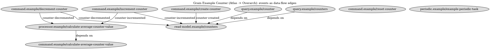

# Grain Adapter

> **Status: Experimental.** Ontology `atlas.ontology.grain`
> (`core/src/atlas/ontology/grain.cljc`, pure — requires nothing beyond
> Clojure core). Materializer `atlas.adapter.grain`
> (`examples/grain/src/atlas/adapter/grain.clj`, the only place the grain
> library appears).

Author [Grain](https://github.com/ObneyAI/grain) applications in Atlas.
Entities are defined once, semantically, in the Atlas registry; grain's
mechanical registrations (`register-command!`, `register-query!`, …) are
**derived projections**. In the full version of this story grain's
`defcommand` / `defquery` / `defreadmodel` / `defprocessor` / `defperiodic`
macros are never used — grain becomes the execution substrate, Atlas the
definition layer. But that is the *endgame*, not the entry point.

Where the [Overarch adapter](adapter-overarch.md) *exports* Atlas outward for
rendering, this adapter points the other way: Atlas is the authoring surface
for a running system.

## How to adopt: a gradient, not a leap

Nothing here requires rewriting an app. Each step is independently useful and
each is already built and verified:

1. **Reflect (zero change to your code).** Import your running app's catalog
   into Atlas — [adapter-grain-import.md](adapter-grain-import.md) did this to
   grain-todo-list (73 entities, one `import-catalog!` call) and immediately
   found a real orphan event (`:event.user/logged-in`). You get the queries,
   the invariant report, blast-radius, and cloud diffs on day one, and your
   grain code doesn't know Atlas exists.
2. **Check (still zero authoring change).** Keep the import fresh (re-import
   is idempotent) and run the invariants + `observed-vs-declared` in CI —
   defects like orphan events and public writes surface before deploy.
3. **Author (opt-in, per slice).** For new slices, invert: define in Atlas,
   `materialize!` into grain, `verify!` the loop closed. This is the rest of
   this document — the payoff is largest here, but nothing forces the switch,
   and the two modes coexist per-entity.

## Why

Grain and Atlas share an enemy — agent/LLM drift — and attack it from
opposite ends. Grain narrows the runtime substrate (one way to change state,
schemas gate everything, constraints bottom out at the storage layer). Atlas
adds a reflective layer above the code (compound identity, data-flow,
invariants). The demo makes the case that the reflective layer earns its keep
even over a substrate as disciplined as grain's:

| Grain | Atlas |
|---|---|
| Kind lives in the macro *name* (`defcommand` vs `defquery`) | Kind is *data* — a `:grain/*` aspect on a compound identity |
| Five separate registries, no cross-registry joins | One registry; "consumers of event X" is a query |
| `:authorized?` presence is checked, its meaning is not | `:access/public` + `:effect/write` is a flaggable fact |
| `:missing-schemas` is a hand-rolled one-off check | One invariant among six, same engine as every other rule |
| Same qualified name may denote different kinds | Global dev-ids force the distinction |

## What the combination buys

Grain governs **how state changes at runtime**; Atlas governs **what the
system means at design time**. The event store is the source of truth for
*facts*; the Atlas registry is the source of truth for *meaning* — and each
layer catches what the other structurally cannot.

Demonstrated by the demo (`examples/grain`):

1. **Defects surface before a single event is appended.** The invariant
   report runs between definition and execution. Against grain's own example
   app it finds an orphan event (`average-calculated` — produced forever,
   consumed by nothing) and four publicly-writable commands. Grain validates
   *shape* at runtime; it has no place to express "every event needs a
   consumer".
2. **Kind is data, so the system is queryable as a whole.** Grain's five
   registry atoms can't join; in Atlas, "consumers of `counter-incremented`",
   "all write paths in `:domain/counter`", "every public command" are
   one-line queries. The whole reactive chain — event → processor →
   dispatched command → new event — is declared, visible data.
3. **Semantics have operational teeth.** `:status/deprecated` isn't a
   comment — the materializer refuses to register it. `:access/*` aspects
   *become* the `:authorized?` predicate, deny-by-default.
4. **The loop is closed against drift.** `verify!` reads grain's own catalog
   back and diffs it against the declarations — declared-but-missing is
   drift; live-but-undeclared is flagged as unmanaged (it caught the control
   plane's internal read models unprompted). The two registries cannot
   silently diverge.
5. **Compound identity forces semantic honesty.** Entities grain
   distinguishes only by *name* (increment/decrement commands, the four
   events) collide in Atlas until given real distinguishing aspects. That
   friction is the feature: the registry refuses entities that mean the same
   thing.
6. **Architecture becomes versioned data.** The demo registry
   (`grain/example-counter`) is diffable and timelinable, with
   `suggest-placement` giving semantic neighbors for anything new — and a
   fleet-wide vantage point when several grain services share one org
   registry.

Direct consequences, not yet built:

- **Change governance** — `before-change` / `blast-radius` on a grain app
  answers "what breaks if I change this event's schema?" (read model,
  processor, downstream command chain) before you touch it. An invariant
  tying event-schema changes to read-model `:version` bumps gives
  event-evolution discipline grain leaves to convention.
- **The agent workflow, end to end.** Both projects are explicitly
  AI-native. Grain's `code-agent-tools` gives an agent runtime guardrails
  (catalog, validate payload, invoke); Atlas gives it design-time guardrails
  (suggest-placement, invariants, blast radius). Together an agent can find
  where a new feature belongs semantically, author the Atlas entity, get
  invariant feedback, materialize, validate, and execute — every step
  checkable, at both ends. Neither project alone covers the full path from
  intent to appended fact.
- **Free renderings and upper layers** — the same registry feeds the
  [Overarch adapter](adapter-overarch.md) (C4/UML of the grain app), the
  visual explorer, and the business-value ontologies (commands linked to
  value propositions — vocabulary grain does not have).

The honest cost: one extra layer to keep truthful (mitigated by `verify!`
being cheap enough for the REPL loop); a few more lines per entity than
grain's macros — deliberately, see below; and grain evolves fast, though the
adapter touches only six stable public registration functions.

**Deliberately macro-free.** Authoring stays plain `defn` + `register!` —
no `defentity` sugar. Macros are how grain pays its tooling tax: custom
clj-kondo hooks that need maintenance (grain's own log has bugfixes for
theirs), broken go-to-definition on generated vars, definitions that exist
only as expansion side-effects. Plain data keeps LSP navigation intact,
keeps qualified keywords first-class (which the
[YAML-LD adapter](adapter-yaml-ld.md) relies on to project identities as
IRIs), and keeps every definition inspectable and serializable. The few
extra lines are the price of the property the whole design argues for:
definitions as data, not syntax.

In short: grain makes drift structurally impossible at the storage layer;
Atlas makes it structurally impossible at the meaning layer. Together,
nothing runs that wasn't declared, and nothing is declared that can't be
reasoned about.

## The mapping

No new entity types — grain kinds are aspects on existing Atlas types:

| grain kind | Atlas type | kind aspect |
|---|---|---|
| `defcommand` | `:atlas/execution-function` | `:grain/command` |
| `defquery` | `:atlas/execution-function` | `:grain/query` |
| `defreadmodel` | `:atlas/execution-function` | `:grain/read-model` |
| `defprocessor` | `:atlas/execution-function` | `:grain/todo-processor` |
| `defperiodic` | `:atlas/execution-function` | `:grain/periodic-task` |
| event schema | `:atlas/data-schema` | `:grain/event` |

Entity props (all specced in `atlas.ontology.grain`):

| prop | meaning | grain destination |
|---|---|---|
| `:grain/produces` | event entities appended | — (semantic only) |
| `:grain/consumes` | event entities subscribed | read model `:events` / processor `:topics` |
| `:grain/dispatches` | commands a processor issues | — (semantic only) |
| `:grain/reads` | read models a query projects | — (semantic only) |
| `:grain/schema` | malli payload schema | schema-util registry |
| `:grain/schedule` | cron / interval map | periodic trigger `:schedule` |
| `:grain/version` | cache-busting version | read model `:version` |
| `:atlas/impl` | handler / reducer fn (not serialisable) | the registered `:handler-fn` |

### Data-flow edges come from type-refs

`:grain/produces` / `:grain/consumes` / `:grain/dispatches` / `:grain/reads`
are declared as `:atlas/type-ref` entities sourced at
`:atlas/execution-function`. The existing execution-function datalog
extractor picks up **all** type-refs for its source type generically, so the
grain ontology ships zero extractor code — the same mechanism the Overarch
adapter relies on.

### Dev-id rule: kind-prefixed namespaces

Grain's five registries allow the same qualified name to denote different
kinds — its own example app uses `:example/counters` as both a query and a
read model. Atlas dev-ids are global, so the mapping prefixes the namespace
with the kind and stays round-trippable by stripping the first segment:

```
:command.example/create-counter  ↔  defcommand   :example create-counter
:query.example/counters          ↔  defquery     :example counters
:read-model.example/counters     ↔  defreadmodel :example counters
:event.example/counter-created   ↔  event type   :example/counter-created
```

### Access policy: `:access/*`, deliberately not `:auth/*`

`:auth/*` is established Atlas vocabulary for data-descriptor keys
(`:auth/token`, `:auth/user-id` in context vectors). Overloading it with
policy aspects would blur that line, so policy gets a fresh namespace:
`:access/public` (grain's `{:authorized? (constantly true)}`) and
`:access/enforced` (a real predicate, supplied as `:grain/authorized?`).
Materialization is deny-by-default, like grain itself.

## Invariants

| invariant | severity | catches |
|---|---|---|
| `grain-command-declares-access` | error | command without any access policy |
| `grain-no-public-write` | warning | `:effect/write` + `:access/public` |
| `grain-orphan-events` | warning | events produced but never consumed |
| `grain-event-has-producer` | warning | events registered but never produced |
| `grain-refs-valid` | warning | dangling / mistyped data-flow refs |
| `grain-deprecated-requires-reason` | error | terminal state without recorded why |

Against grain's own example counter app these find **real defects grain
cannot see**: `:example/average-calculated` is produced but consumed by
nothing (dead data flow), and all four commands are publicly writable.
Compound identity also forced two distinctions grain never asks for —
increment/decrement commands, and the four events, initially had identical
aspect sets and silently collapsed until distinguished with `:operation/*`
aspects (shared between each command and the event it produces).

## Materialization & verification

`atlas.adapter.grain/materialize!` walks the registry and routes each live
entity to grain's public registration functions by kind aspect.
`:status/deprecated` entities are **not** registered — deprecation has
operational meaning, not just documentation.

`atlas.adapter.grain/verify!` closes the loop: it reads grain's own
`code-agent-tools` catalog back and diffs it against the Atlas declarations.
In-sync means declared ⊆ live; live entries Atlas didn't declare (e.g. the
control plane's `:grain.control/*` read models) are reported as *unmanaged
framework internals*, not drift.

## Running the demo

```bash
cd examples/grain
clojure -M:demo
```

The demo (1) registers the counter app as Atlas entities, (2) runs the
invariant report, (3) materializes into grain, (4) verifies grain's catalog
against the declarations, and (5) executes for real on grain's in-memory
event store — including the async chain the registry declared:
`counter-incremented` → todo-processor → `calculate-average` command →
`average-calculated` event.

For interactive work, `clojure -M:nrepl` starts an nREPL (port 7899) and the
same five acts run as REPL forms — see `grain-demo.demo` for the pieces. The
iteration loop is where Atlas authoring pays off day-to-day:

```clojure
(require 'grain-demo.counter :reload)   ; edit the atlas registration
(grain-demo.counter/init-registry!)
(atlas.invariant/report)                ; catch drift BEFORE it runs
(atlas.adapter.grain/materialize!)      ; re-project (registries are atoms — idempotent)
(atlas.adapter.grain/verify!)           ; confirm grain matches the declaration
```

Grain is consumed via `:local/root` to a sibling checkout for the spike
(swap for `:git/url` + `:git/sha` deps for portability; grain requires
Clojure 1.12). The read-model cache uses an in-memory `KVStore`
(`grain-demo.mem-kv`) because `kv-store-lmdb`'s native library requires
glibc ≥ 2.36.

## Roadmap

### Horizon 1 — solidify the spike

1. **Keep authoring macro-free, smooth the edges as data** — no `defentity`
   macro (see "Deliberately macro-free" above: LSP navigation, kondo hooks,
   RDF-projectable keywords). Ergonomics improvements must be plain
   functions or data: registration-time spec validation of `:grain/*` props
   with readable errors, and optionally entity templates (data maps merged
   into `register!` calls).
2. **Unify the schema story** — entities currently carry both
   `:data-schema/fields` and `:grain/schema` (malli), duplicated by hand.
   Derive one from the other; add an invariant flagging divergence.
3. **Snapshot export as a function** — `exportable-snapshot` (strip fns,
   include ontology descriptors + type-refs) so cloud pushes are repeatable
   and the ontology-in-registry convention is encoded, not tribal.
4. **Tests + portability** — kaocha coverage for `grain-name` round-trip,
   materialize routing, verify semantics, and the invariants (the core-only
   mock in `test/app/grain_counter.clj` runs grain-free from root); swap
   `:local/root` for git-SHA deps.

### Horizon 2 — the unique payoff

5. **Observed-vs-declared invariant** — ✅ **done**: `materialize!` wraps
   every command impl with an observation recorder (emitted event types,
   anomaly verdicts); `observed-vs-declared` audits observations against
   `:grain/produces` / `:grain/outcomes`, and the registered invariant
   raises an **error** on undeclared emissions (verified with a deliberately
   lying declaration) and a warning on declared-but-unexercised events. The
   demo's act 7 prints the audit — the live run and the test-cases feed it
   for free.
6. **Event-schema evolution governance** — ✅ **done**:
   `schema-evolution-check [old-registry new-registry]` — for every
   `:grain/event` whose `:grain/schema` changed between versions, every
   consuming read model must bump `:grain/version`. Verified both ways
   against real snapshots.
7. **`blast-radius` over grain** — ✅ **done**: `:grain/reads` /
   `:grain/dispatches` are additionally mirrored into
   `:execution-function/deps` (they are runtime dependencies), which the
   reverse-deps tools traverse. Against `grain/todo-list`:
   `blast-radius :read-model.todo/tasks` → six query pages at 1 hop;
   `trace-data-key :event.todo/task-captured` → produced-by `capture-task`,
   consumed-by `tasks`, connected.
8. **Import leg (grain → atlas)** — ✅ **done**, see
   [adapter-grain-import.md](adapter-grain-import.md): grain-todo-list
   (73 entities) imported via `import-catalog!` and pushed to
   `grain/todo-list/main/v0.1.0`; all error invariants pass, one real orphan
   event found (`:event.user/logged-in`). Remaining from this item:
   `:draft/*` aspect enrichment per domain.
9. **Overarch rendering** — ✅ **done**: the counter registry exported
   through the [Overarch adapter](adapter-overarch.md) and rendered with
   GraphViz — `docs/adapter-overarch/grain-counter/`
   (`model.edn` + `views.edn` + concept view). Events render as data-flow
   *edge labels* between producer and consumer; the orphan
   `average-calculated` shows up visually as a dead-end command, and the
   deprecated `reset-counter` as an isolated node.

   

### Horizon 3 — scale and ecosystem

10. **Multi-service org registry** — several grain services, one org;
    events crossing service boundaries become visible cross-service
    data-flow.
11. **Business layer** — commands linked to `:atlas/value-proposition`,
    Shape Up pitches referencing grain entities; "which bets touch this
    event" becomes a query.
12. **Agent skill** — a `/grain-feature` skill composing the full loop:
    `suggest-placement` → author entity → invariants → materialize →
    grain-side `validate` → `invoke-command!` → observed-vs-declared check.
    The end-to-end AI-native story both projects claim, actually assembled.
13. **Upstream engagement** — a small PR making grain's `example-service` a
    consumable package; demo material for the grain community. The thesis
    lands better as a conversation than a fork.

If only two: schema unification (one source of truth, mechanically checked)
and observed-vs-declared (the argument nobody else can make — the ledger
audits the meaning layer, and the meaning layer explains the ledger).
