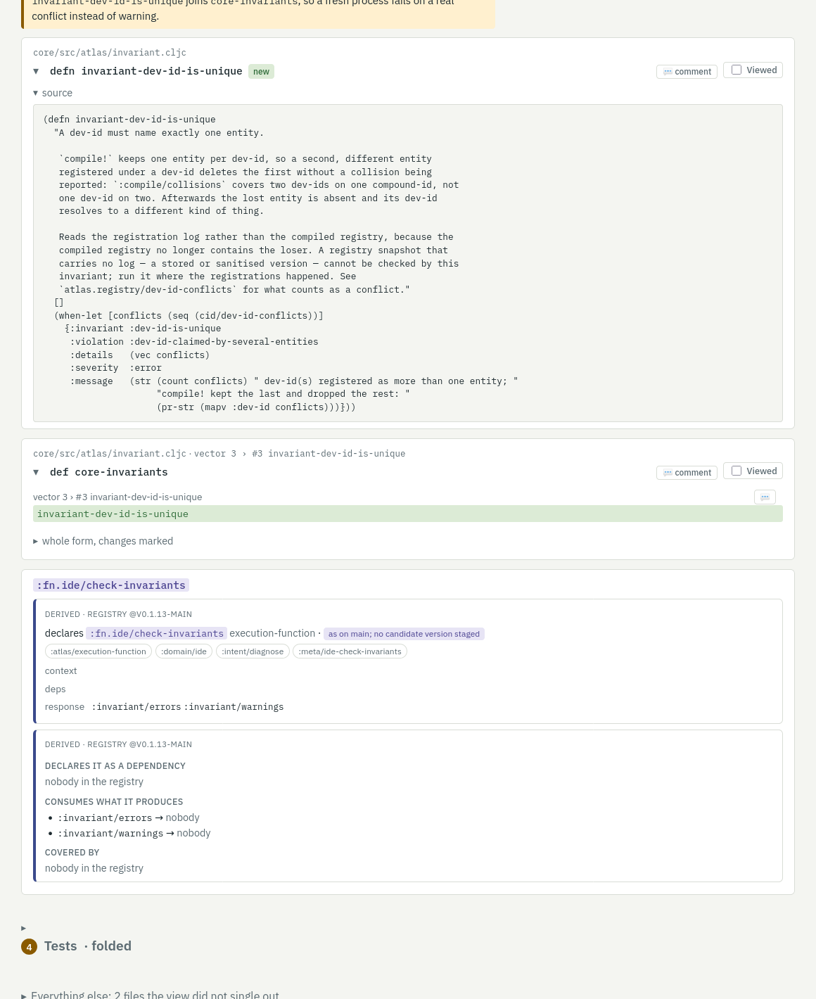
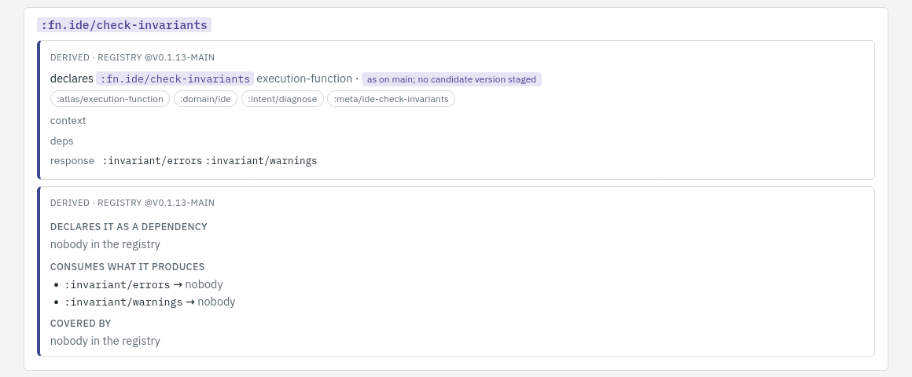

# review

The [sdiff](https://github.com/semantic-namespace/diff) review server for a
project with an atlas registry. The report page of a pull request gets
derived decorations from the registry, beside each changed form and at the
top:

- the entity a form declares, with its contract and the delta between the
  main version and the PR's candidate version from the atlas-cloud diff;
- who depends on that entity, who consumes what it produces, which test
  cases cover it;
- the data keys the changed code mentions, with their producers and consumers;
- a header listing every entity the PR's registry diff touched, linked to the
  form that changed it, or marked when no form in the diff did.

All of it answers through `atlas.ide` with the stored version bound as the
registry. Inferred annotations, from a reviewer or a model, render apart and
labelled.

```
clojure -M:serve --org acme --project shop [--port 7878] [--host 127.0.0.1]
```

A view over a pull request of the atlas repo itself, with the registry
decoration of an entity the view names:



The entity block alone: what it declares, with its state against the base
version, and who depends on it, what consumes what it produces, which test
cases cover it:



`ATLAS_CLOUD_URL` names the cloud holding the versions (default
`http://localhost:8090`). The base is the newest `vN.N.N` version. The
candidate is the version named `pr<N>-<head sha>`; when it is missing the
server downloads the registry CI built for that head (the `registry` artifact
of the project's `atlas-registry` workflow, through `gh`) and stages it with
`ATLAS_CLOUD_KEY`. When CI has no run for the head, the page says so and
shows entities as on main.
